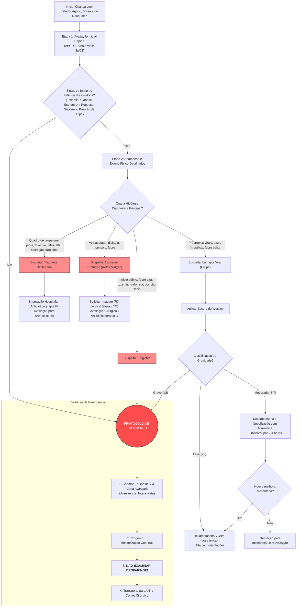

```mermaid
graph TD
    A["Início: Criança com Estridor Agudo, Tosse e/ou Rouquidão"] --> B["Etapa 1: Avaliação Inicial Rápida <br/> (ABCDE, Sinais Vitais, SpO2)"];
    
    B --> C{"Sinais de Iminente Falência Respiratória? <br/>(Toxemia, Cianose, Estridor em Repouso, Sialorreia, Posição de Tripé)"};
    
    C -- Sim --> D((PROTOCOLO DE EMERGÊNCIA));
    
    subgraph "Via Aérea de Emergência"
        D --> D1["1. Chamar Equipe de Via Aérea Avançada<br/>(Anestesista, Intensivista)"];
        D1 --> D2["2. Oxigênio + Monitorização Contínua"];
        D2 --> D3["3. <strong>NÃO EXAMINAR OROFARINGE!</strong>"];
        D3 --> D4["4. Transporte para UTI / Centro Cirúrgico"];
    end
    
    C -- Não --> E["Etapa 2: Anamnese e Exame Físico Detalhados"];
    
    E --> F{"Qual a Hipótese Diagnóstica Principal?"};
    
    F -- "Início súbito, febre alta, toxemia, sialorreia, posição tripé" --> H["Suspeita: Epiglotite"];
    F -- "Quadro de crupe que piora, toxemia, febre alta, secreção purulenta" --> I["Suspeita: Traqueíte Bacteriana"];
    F -- "Voz abafada, disfagia, torcicolo, febre" --> J["Suspeita: Abscesso Profundo (Retrofaríngeo)"];
    F -- "Pródromos virais, tosse 'metálica', febre baixa" --> G["Suspeita: Laringite Viral (Crupe)"];
    G --> G1["Aplicar Escore de Westley"];
    G1 --> G2{"Classificação da Gravidade?"};
    G2 -- "Leve (≤2)" --> G3["Dexametasona VO/IM (dose única) <br/> Alta com orientações"];
    G2 -- "Moderado (3-7)" --> G4["Dexametasona + Nebulização com Adrenalina <br/> Observar por 2-4 horas"];
    G4 --> G5{"Houve melhora sustentada?"};
    G5 -- Sim --> G3;
    G5 -- Não --> G6["Internação para observação e reavaliação"];
    
    
    H --> D;
    G2 -- "Grave (≥8)" --> D;

    
    I --> I1["Internação Hospitalar <br/> Antibioticoterapia IV <br/> Avaliação para Broncoscopia"];
    
    J --> J1["Solicitar Imagem (RX cervical lateral / TC) <br/> Avaliação Cirúrgica + Antibioticoterapia IV"];

    style D fill:#ff4d4d,stroke:#333,stroke-width:2px,color:#fff
    style H fill:#ff8c8c,stroke:#333
    style I fill:#ff8c8c,stroke:#333
    style J fill:#ff8c8c,stroke:#333
```
