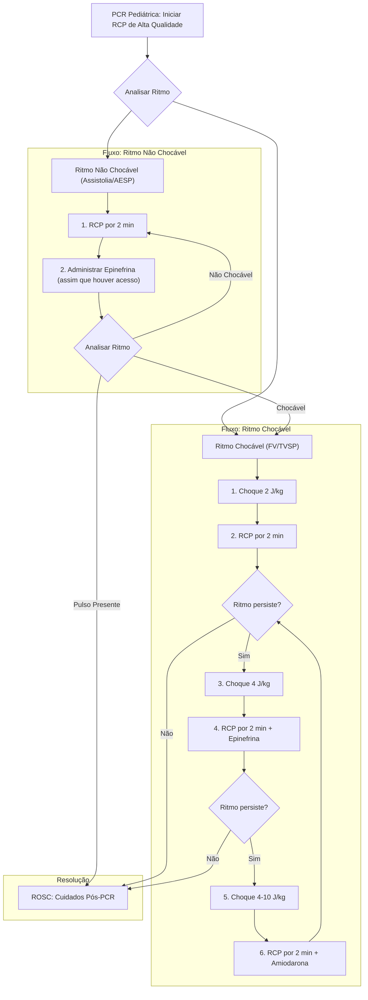

```mermaid
graph TD
    A["PCR Pediátrica: Iniciar RCP de Alta Qualidade"] --> B{Analisar Ritmo};
    B --> C["Ritmo Chocável (FV/TVSP)"];
    B --> D["Ritmo Não Chocável (Assistolia/AESP)"];

    subgraph "Fluxo: Ritmo Chocável"
        C --> C1["1. Choque 2 J/kg"];
        C1 --> C2["2. RCP por 2 min"];
        C2 --> C3{Ritmo persiste?};
        C3 -- Sim --> C4["3. Choque 4 J/kg"];
        C4 --> C5["4. RCP por 2 min + Epinefrina"];
        C5 --> C6{Ritmo persiste?};
        C6 -- Sim --> C7["5. Choque 4-10 J/kg"];
        C7 --> C8["6. RCP por 2 min + Amiodarona"];
        C8 --> C3;
    end

    subgraph "Fluxo: Ritmo Não Chocável"
        D --> D1["1. RCP por 2 min"];
        D1 --> D2["2. Administrar Epinefrina (assim que houver acesso)"];
        D2 --> D3{Analisar Ritmo};
        D3 -- Não Chocável --> D1;
        D3 -- Chocável --> C;
    end
    
    subgraph "Resolução"
       C3 -- Não --> E["ROSC: Cuidados Pós-PCR"];
       C6 -- Não --> E;
       D3 -- Pulso Presente --> E;
    end
```
